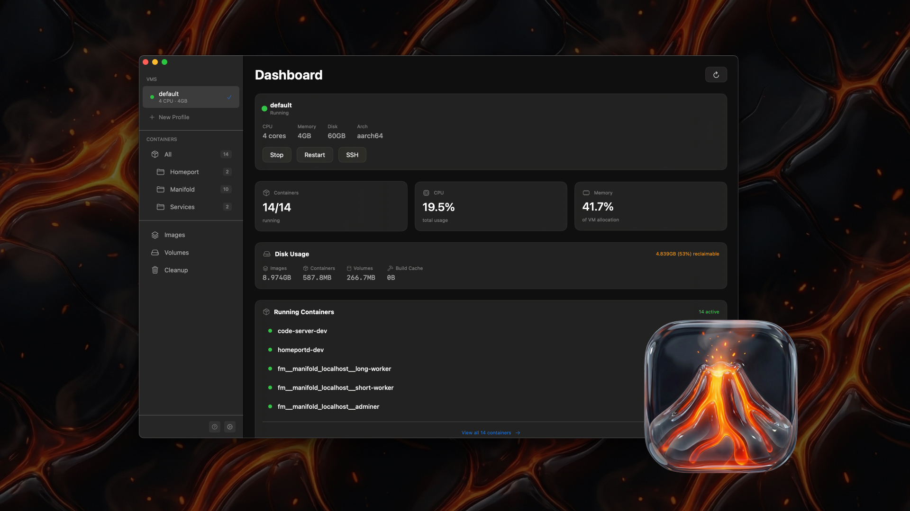

# ColimaUI

A native macOS app for managing Colima VMs and Docker containers.



## Features

- **Multi-VM Support**: Create and manage multiple Colima VM profiles
- **Container Management**: View, start, stop, restart, and remove containers
- **Real-time Stats**: Live CPU and memory usage per container
- **Log Viewer**: Stream container logs in real-time
- **Image Management**: List and remove Docker images
- **Volume Management**: List, remove, and prune Docker volumes
- **Cleanup Tools**: Prune dangling images, build cache, and unused data
- **Local Domains (Colima)**: Zero-config container/compose domains with automatic DNS, routing, and local TLS

## Installation

1. Download the latest release from [GitHub Releases](https://github.com/ryanmish/ColimaUI/releases)
2. Unzip and drag `ColimaUI.app` to your Applications folder
3. On first launch, right-click the app and select **Open** (bypasses Gatekeeper for unsigned apps)

Or run this in Terminal to remove the quarantine flag:
```bash
xattr -cr /Applications/ColimaUI.app
```

## Requirements

- macOS 14.0 (Sonoma) or later
- [Colima](https://github.com/abiosoft/colima) installed via Homebrew
- Docker CLI

If you don't have Colima installed, the app will guide you through the installation process.

## Local Domains

ColimaUI can configure local domains end-to-end from Settings:
- wildcard DNS via dnsmasq
- macOS resolver setup
- automatic reverse proxy startup
- automatic local TLS certs with `mkcert`
- index page at `index.dev.local`
- background autopilot that reconciles and repairs domain routing

See detailed workflow documentation: [`docs/local-development-workflow.md`](docs/local-development-workflow.md)
Next planned UX/runtime behavior work: [`docs/next-quit-behavior.md`](docs/next-quit-behavior.md)

Generated domains:

- Compose service: `service.project.dev.local`
- Container fallback: `container-name.dev.local`

Configure in **Settings -> Local Domains**:

- Enable/disable local domain links
- Domain suffix is fixed to `.dev.local`
- Prefer HTTPS for link opening
- Autopilot keeps local-domain routing healthy in the background
- Advanced setup/check tools remain available for manual recovery
- CLI URL listing: `colimaui domains urls`
- Supports custom domain labels: `dev.colimaui.domains`
- Supports wildcard custom domains (for example `*.api.dev.local`)
- Supports HTTP port override label: `dev.colimaui.http-port=8080`

Example (custom domains + port override):

```yaml
services:
  api:
    image: my-api
    labels:
      - dev.colimaui.domains=api.dev.local,docs.dev.local
      - dev.colimaui.http-port=3000
```

## Building from Source

Requires [XcodeGen](https://github.com/yonaskolb/XcodeGen) to generate the Xcode project.

```bash
# Install XcodeGen if needed
brew install xcodegen

# Clone the repo
git clone https://github.com/ryanmish/ColimaUI.git
cd ColimaUI

# Generate Xcode project
xcodegen generate

# Open in Xcode
open ColimaUI.xcodeproj

# Build and run (Cmd+R)
```

## Contributing

Contributions are welcome! Please open an issue or submit a pull request.

## License

Source Available - Free to use (including commercially), but not for resale. See [LICENSE](LICENSE) for details.
